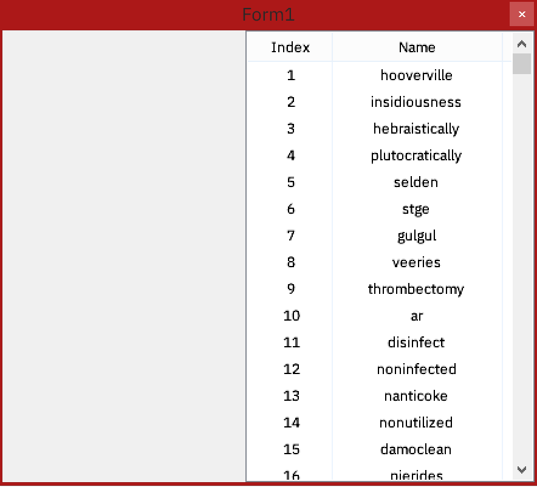
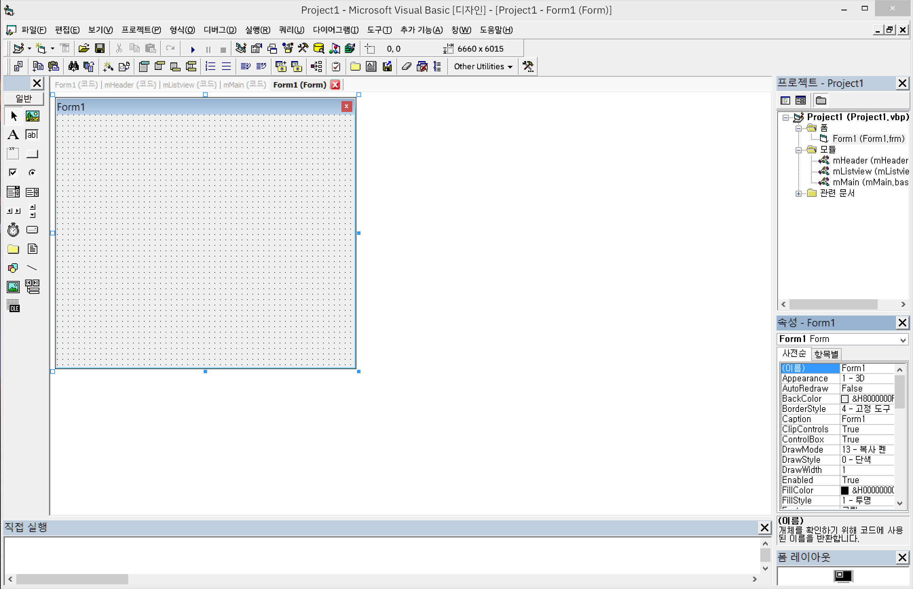

# virtualize-listview

   
   
 

 
 ListView virtualization example coded by Visual Basic 6.
 
***

## What's the difference?

It is extremely slow to add large amounts of data to the default listview controls.

List virtualization is dynamically depicts where you are looking at.

With list virtualization, we can achieve to escape from turtle-like loading. 😂
